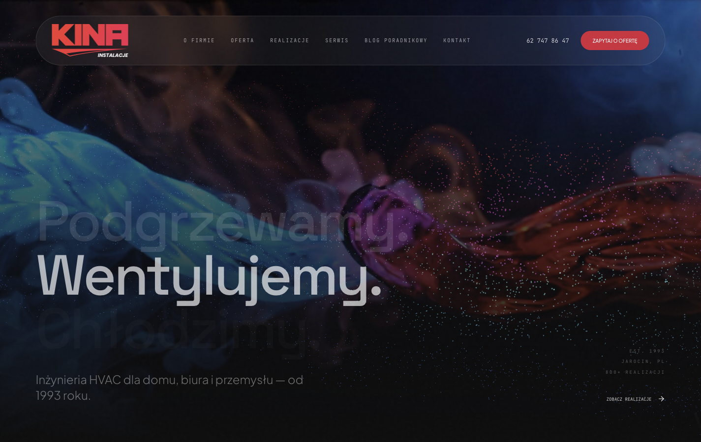
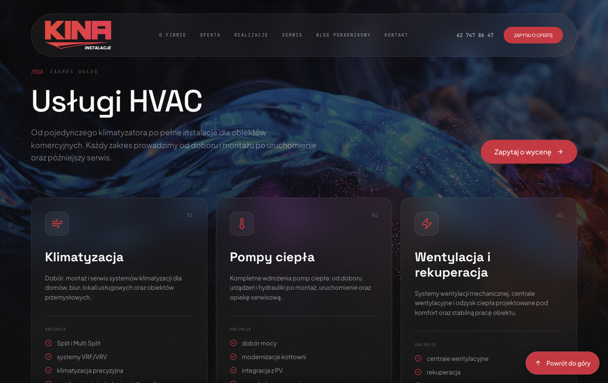
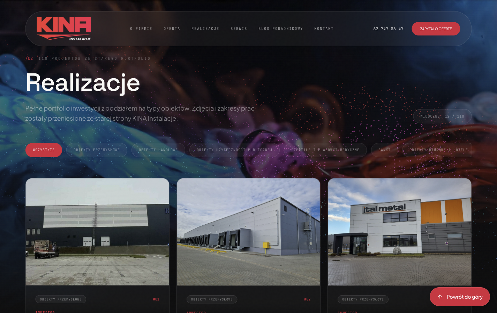
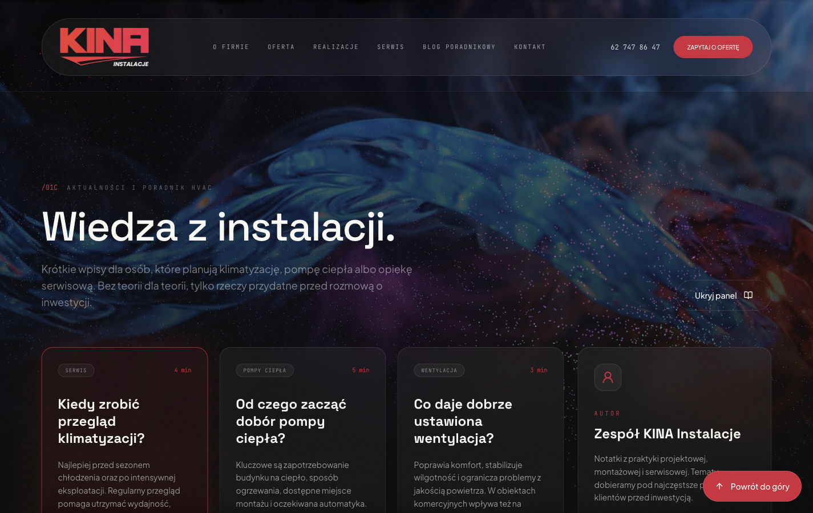
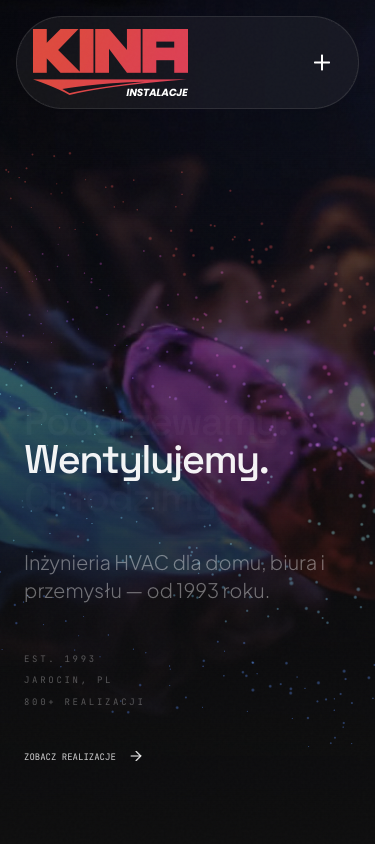

# KINA Instalacje - HVAC Website

Nowoczesna strona firmowa dla marki KINA Instalacje, zaprojektowana jako dynamiczna, responsywna prezentacja oferty HVAC, realizacji, serwisu oraz poradnika eksperckiego.

Projekt laczy wizerunkowy landing page, rozbudowane portfolio realizacji, blog poradnikowy i interaktywne tlo WebGL inspirowane przeplywem powietrza, ciepla i energii.



## Najwazniejsze funkcje

- responsywny landing page dla firmy HVAC
- interaktywne tlo video z warstwa WebGL/Three.js reagujaca na kursor
- sekcje: oferta, uslugi HVAC, proces wspolpracy, serwis, FAQ i kontakt
- portfolio 100+ realizacji z kategoriami i przyciskiem "Pokaz wiecej"
- blog poradnikowy z osobnymi widokami artykulow
- formularz kontaktowy z walidacja HTML i gotowa wiadomoscia e-mail
- autoryzowani partnerzy serwisowi z logo marek
- semantyczna struktura HTML5: `nav`, `header`, `main`, `section`, `article`, `aside`, `footer`
- animacje, hover states, focus states i dopracowany widok mobile

## Screeny

### Oferta i uslugi



### Realizacje



### Blog poradnikowy



### Widok artykulu


### Mobile



## Tech stack

- React 19
- TypeScript
- Vite
- Tailwind CSS
- Motion
- Three.js
- Lucide React

## Uruchomienie lokalne

Wymagania:

- Node.js
- npm

Instalacja zaleznosci:

```bash
npm install
```

Start serwera developerskiego:

```bash
npm run dev
```

Domyslny adres lokalny:

```text
http://localhost:3000/
```

Build produkcyjny:

```bash
npm run build
```

Sprawdzenie typow:

```bash
npm run lint
```

## Struktura projektu

```text
kina-instalacje/
├── assets/
│   ├── partners/
│   ├── realizations/
│   └── 3.mp4
├── docs/
│   └── screenshots/
├── src/
│   ├── App.tsx
│   ├── InteractiveFlowField.tsx
│   ├── index.css
│   ├── realizations-data.ts
│   └── site-config.ts
├── index.html
├── package.json
└── vite.config.ts
```

## Zakres projektu

Strona zostala przygotowana jako kompletna prezentacja firmy instalacyjnej z branzy HVAC. Zawiera tresci ofertowe, dane kontaktowe, realizacje, sekcje serwisowe i materialy poradnikowe. Projekt jest nastawiony na pierwsze wrazenie, wiarygodnosc i szybkie przejscie uzytkownika do kontaktu.

## Autor

Projekt edukacyjno-komercyjny przygotowany dla strony KINA Instalacje.
